# TeddyPlayer

Turn Tonie figures into a multi-room audio controller. Place a Tonie on any RFID reader and play the audio on your Sonos, Chromecast, AirPlay speaker, or browser.


## Why TeddyPlayer?

**The Problem**: You have a Toniebox (or TeddyCloud setup) and a house full of better speakers - Sonos, HomePods, Chromecast speakers. Your kids love placing Tonies on the box, but you want the audio on your multi-room system.

**The Solution**: TeddyPlayer acts as a bridge. Place a Tonie on a simple RFID reader (or use the web UI), and the audio plays on whatever speaker you choose. No proprietary hardware lock-in.

### Key Benefits

- **Use your existing speakers** - Sonos, Chromecast, AirPlay, or any browser
- **Multi-room audio** - Play in the kitchen while cooking, living room for story time
- **Simple interface** - Kids can place figures, you control where it plays
- **Progressive playback** - Audio starts in seconds, no waiting for full encoding
- **Works with TeddyCloud** - Leverages your existing Tonie library

## Architecture

```mermaid
flowchart TB
    subgraph network["Your Network"]
        TC[("TeddyCloud<br/>Tonie DB + Audio")]
        TP["TeddyPlayer<br/>Transcoding + Web UI"]
        
        TC <-->|API| TP
        
        TP --> Sonos["🔊 Sonos"]
        TP --> AirPlay["🔊 AirPlay"]
        TP --> Chromecast["🔊 Chromecast"]
        TP --> Browser["🌐 Browser"]
        
        RFID["📻 RFID Reader<br/>(ESP32 + PN5180)"] --> TP
    end
```



### Data Flow

1. **Trigger**: Tonie placed on RFID reader → Reader sends UID to TeddyPlayer
2. **Lookup**: TeddyPlayer queries TeddyCloud for metadata and audio URL
3. **Transcode**: FFmpeg converts Tonie audio (Opus in TAF container) to MP3
4. **Stream**: MP3 streams to the selected playback device
5. **Cache**: Encoded audio cached for instant replay

### Progressive Multi-Track Playback

Tonie audiobooks can have 40+ chapters. TeddyPlayer handles this elegantly:

- **First track encoded immediately** (~2-5 seconds)
- **Playback starts** while remaining tracks encode in background
- **Tracks added to queue** as they complete
- **Skip buttons** for navigating between tracks

## Quick Start

### Prerequisites

- Docker and Docker Compose
- [TeddyCloud](https://github.com/toniebox-reverse-engineering/teddycloud) running and accessible
- Network access to your playback devices

### Installation

```bash
git clone https://github.com/Kruppes/TeddyPlayer.git
cd TeddyPlayer/server
docker compose up -d
```

Open the web UI at `http://your-server-ip:8754` and configure your TeddyCloud URL in Settings.

### Using Pre-built Images

Once available on GitHub Container Registry:

```bash
docker run -d \
  --name teddyplayer \
  --network host \
  -v /path/to/config:/app/config \
  ghcr.io/kruppes/teddyplayer:latest
```

## Features

### Supported Devices

| Device | Status | Controls |
|--------|--------|----------|
| **Sonos** | Full | Play/Pause, Skip, Volume |
| **Chromecast** | Full | Play/Pause, Stop |
| **AirPlay** | Full | Play/Pause, Stop |
| **Browser** | Built-in | Full HTML5 player |
| **ESPuino** | Optional | Local + Stream modes |

### Web Interface

- Browse your complete Tonie library
- Search and filter by series/episode
- Pre-cache audio for instant playback
- Hide items you don't want to see
- Real-time encoding progress

### RFID Reader (Optional)

Build your own reader with ESP32 + PN5180. See [firmware documentation](firmware/README.md).

Features:
- **Stream mode**: Reader controls external speakers
- **LED status**: Visual feedback for connection/playback state
- **Web config**: Configure via browser at reader's IP
- **OTA updates**: Update firmware over WiFi

## Configuration

### Environment Variables

| Variable | Default | Description |
|----------|---------|-------------|
| `PORT` | 8754 | Server port |
| `ESPUINO_ENABLED` | true | Enable ESPuino features |
| `CONFIG_DIR` | /app/config | Config/cache directory |

### Web UI Settings

- **TeddyCloud URL**: Your TeddyCloud server address
- **Default Device**: Where audio plays by default
- **Cache Size**: Maximum disk space for encoded audio

## Tech Stack

### Backend
- **Python 3.11** + **FastAPI** - Async API server
- **FFmpeg** - Audio transcoding (Opus → MP3)
- **SoCo** / **pychromecast** / **pyatv** - Device control

### Frontend
- **Svelte 5** - Reactive UI with Runes
- **TypeScript** - Type safety
- **Vite** - Build tooling

### Firmware
- **ESP32** + **PN5180** - RFID reader hardware
- **PlatformIO** - Build system

## API Documentation

Interactive docs at `http://your-server-ip:8754/docs`

Key endpoints:
- `POST /tonie` - Trigger playback by UID
- `GET /library` - Fetch Tonie library
- `GET /api/devices` - List playback devices
- `GET /streams` - Active playback sessions

## Development

```bash
cd server
python -m venv .venv && source .venv/bin/activate
pip install -r requirements.txt
uvicorn app.main:app --reload --port 8754
```

---

## About This Project

### AI-First Development

**This entire project was built using agentic AI as an experiment in AI-assisted development.**

From initial architecture to final implementation, TeddyPlayer was developed through continuous collaboration with Claude (Anthropic). The human role was:
- Defining requirements and user experience goals
- Making architectural decisions
- Testing and validating functionality
- Providing feedback and course corrections

The AI handled:
- All code implementation (Python, TypeScript, C++)
- Documentation writing
- Debugging and problem-solving
- Refactoring and optimization

**This is not "AI-assisted" development - this is AI-driven development with human oversight.**

The goal was to explore how far agentic AI can push software development when given clear direction and iterative feedback. The result is a fully functional, production-ready application.

### Motivation

This started as a personal need: I wanted my kids to use Tonie figures but play audio on our Sonos speakers instead of the Toniebox. TeddyCloud solved the audio extraction, but I needed a bridge to multi-room speakers.

It evolved into an experiment: Could AI build this entire system? The answer is yes - with the right feedback loops.

---

## Credits

- [TeddyCloud](https://github.com/toniebox-reverse-engineering/teddycloud) - Tonie audio server
- [ESPuino](https://github.com/biologist79/ESPuino) - ESP32 audio player inspiration
- [SoCo](https://github.com/SoCo/SoCo), [pychromecast](https://github.com/home-assistant-libs/pychromecast), [pyatv](https://github.com/postlund/pyatv) - Device control libraries

## License

[GPLv3](LICENSE) - Compatible with TeddyCloud and ESPuino.

---

*Not affiliated with Tonies GmbH.*
